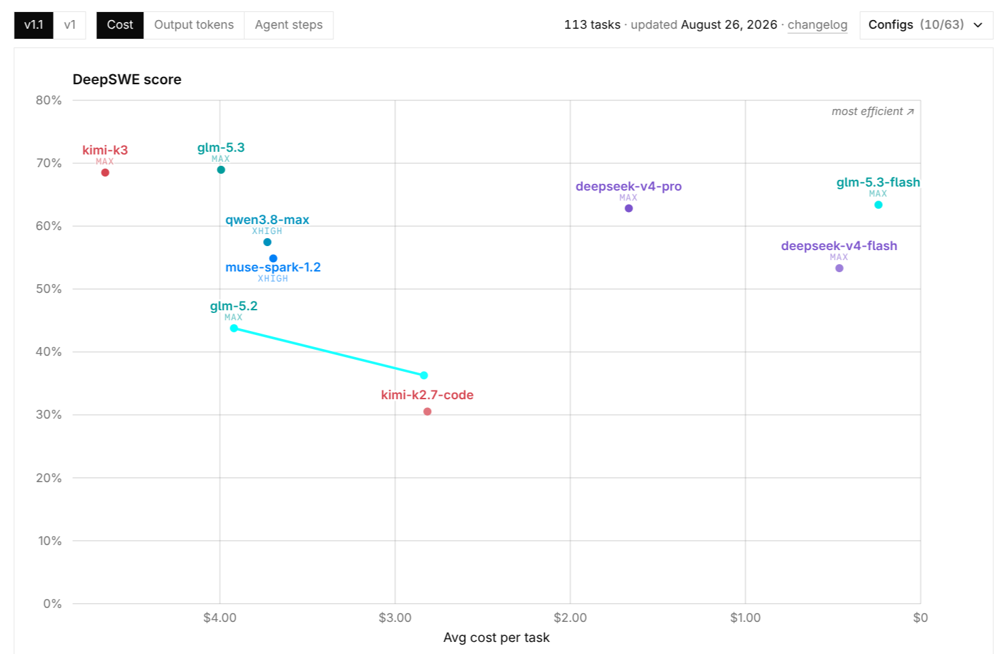
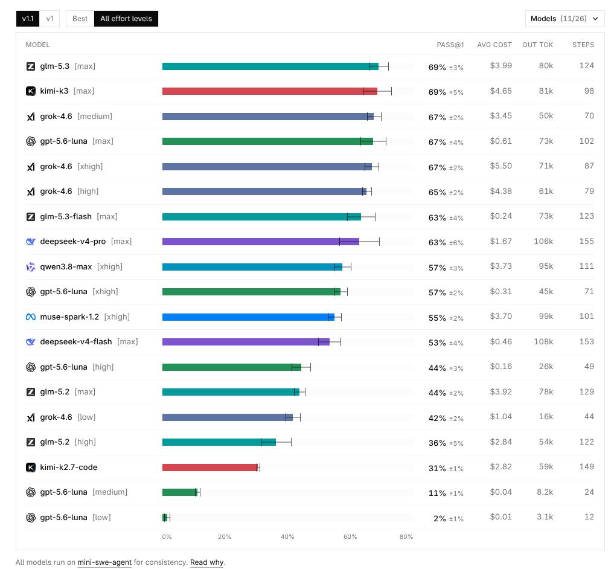
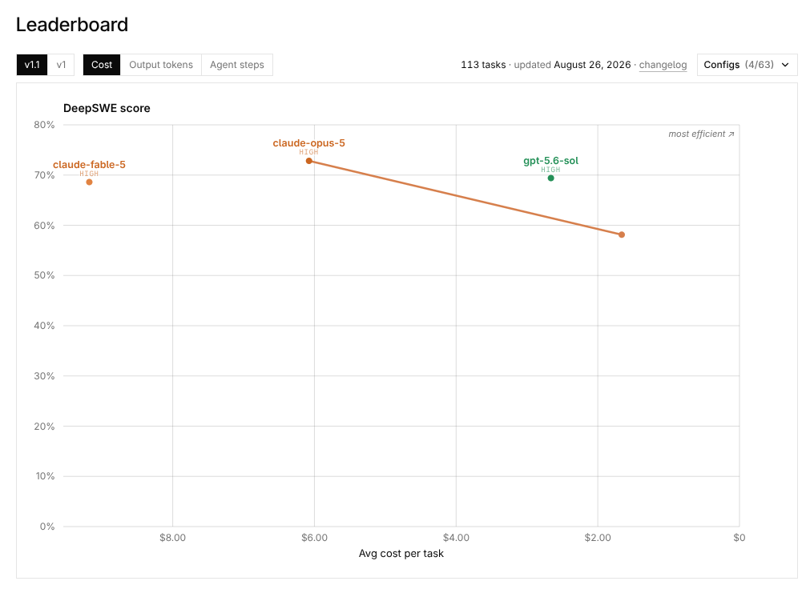
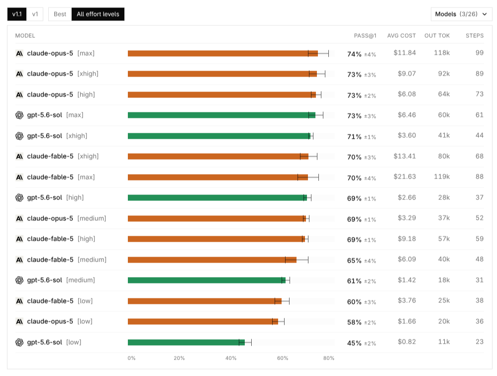
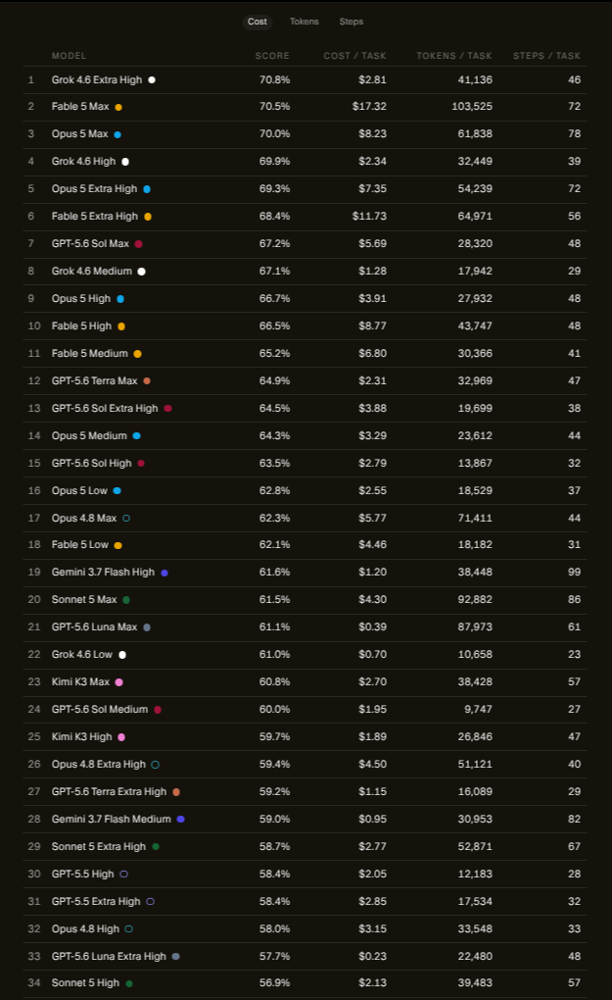
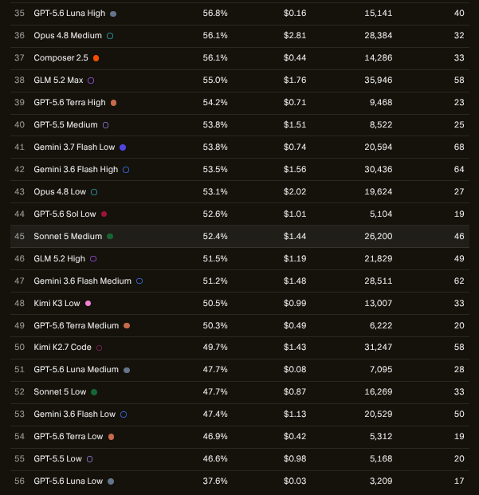

<!-- SYNCED FILE — do not edit. Source: arc-pi docs/arc-model-update-08-30-26.md. Regenerate with: npm run policy:sync (in the arc-pi repository). -->
# AI Model Selection and Orchestration — 2026-08-30 update

**By Andrew Solomon**

**Status:** current. Supersedes
[`docs/arc-model-update-08-18-26.md`](arc-model-update-08-18-26.md), which is
retained unchanged as the historical record of the benchmark analysis and the
reasoning behind the ordering below.

This update changes the ARC Pi parent default and selected
`runner-routing-v4` Implement ordering, and (revision 2026-08-31) adds the
OpenCode Go provider-qualified identities described under
[OpenCode Go expansion](#opencode-go-expansion-2026-08-31). It makes the
ordering machine-readable:
the fenced `arc-model-policy` block below is the single authoritative input for ARC Pi and
the sibling `arc-orchestrator` runner. Everything else in this document is
explanatory prose.

---

## How the policy is consumed

`scripts/sync-model-policy.mjs` parses the normative block deterministically
(no model, no network) and regenerates:

- `extensions/arc-orchestrator/model-policy.generated.ts` — the ARC Pi
  route/launcher consumer (`routes.ts` derives public route bindings, phase
  chains, the nine workload chains, the emergency tail, and the policy label
  from it).
- `defaults/model-policy.json` — the launcher copy `bin/arc-pi` reads for the
  default parent provider/model/thinking.
- `plugins/arc-orchestrator/lib/model-policy.generated.ts` in the sibling
  `arc-orchestrator` repository — the runner copy that `trace-schema.ts`,
  `model-registry.ts`, `routes.ts`, and the generated surfaces consume.
- `docs/arc-model-policy.md` and `scripts/model-policy.mjs` in the runner —
  verbatim copies of this document and the parser, so the runner's
  `scripts/check-model-policy.mjs` can re-derive the digest from Markdown
  without an arc-pi checkout.

Every generated artifact embeds a SHA-256 digest of the canonical policy.
`npm run policy:check` (also part of `npm run verify`) re-parses this document
and fails closed when any ARC Pi artifact, or the runner copies when the
sibling repository is present, are stale or were edited by hand. `bin/arc-pi`
re-parses this document at launch and refuses to start when
`defaults/model-policy.json` carries a different digest, label, or parent
defaults. The ARC Pi and runner policy consumers verify the embedded digest
against the copy's content at load time. The runner's
`bun scripts/check-model-policy.mjs` re-parses its local Markdown copy and
rejects a stale or tampered generated copy; its
`test/model-policy-sync.test.ts` proves that the public bindings, candidate
stacks, workload classes, shipped registry entries (provider model id,
backend, fixed effort), and rendered surfaces equal the copy.

Editing rules:

1. Change the fenced block, never the generated files.
2. Run `npm run policy:sync` in ARC Pi, then `bun run generate:surfaces` in
   the runner.
3. Commit both repositories together; a digest mismatch between them is a
   rejected state, not a warning.

---

## Cost analysis benchmark snapshot

The baseline cost analysis tables are retained from the
[2026-08-18 benchmark record](arc-model-update-08-18-26.md) and extended below
with additional rows from the supplied CursorBench leaderboard. The DeepSWE
images identify candidate models, but their scores and costs are not mixed into
the CursorBench cost tables. All benchmark material is historical evidence
rather than normative routing input.

### Benchmark images

These DeepSWE benchmark snapshots cover 113 tasks and were updated on August
26, 2026.

#### Low-cost models





##### DeepSWE low-cost model analysis

| Model configuration       | Pass@1  | Avg cost | Output tokens | Agent steps |
| ------------------------- | ------- | -------- | ------------- | ----------- |
| GLM 5.3 Max               | 69% ±3% | $3.99    | 80k           | 124         |
| Kimi K3 Max               | 69% ±5% | $4.65    | 81k           | 98          |
| Grok 4.6 Medium           | 67% ±2% | $3.45    | 50k           | 70          |
| GPT-5.6 Luna Max          | 67% ±4% | $0.61    | 73k           | 102         |
| Grok 4.6 Extra High       | 67% ±2% | $5.50    | 71k           | 87          |
| Grok 4.6 High             | 65% ±2% | $4.38    | 61k           | 79          |
| GLM 5.3 Flash Max         | 63% ±4% | $0.24    | 73k           | 123         |
| DeepSeek V4 Pro Max       | 63% ±6% | $1.67    | 106k          | 155         |
| Qwen 3.8 Max Extra High   | 57% ±3% | $3.73    | 95k           | 111         |
| GPT-5.6 Luna Extra High   | 57% ±2% | $0.31    | 45k           | 71          |
| Muse Spark 1.2 Extra High | 55% ±2% | $3.70    | 99k           | 101         |
| DeepSeek V4 Flash Max     | 53% ±4% | $0.46    | 108k          | 153         |
| GPT-5.6 Luna High         | 44% ±3% | $0.16    | 26k           | 49          |
| GLM 5.2 Max               | 44% ±2% | $3.92    | 78k           | 129         |
| Grok 4.6 Low              | 42% ±2% | $1.04    | 16k           | 44          |
| GLM 5.2 High              | 36% ±5% | $2.84    | 54k           | 122         |
| Kimi K2.7 Code            | 31% ±1% | $2.82    | 59k           | 149         |
| GPT-5.6 Luna Medium       | 11% ±1% | $0.04    | 8.2k          | 24          |
| GPT-5.6 Luna Low          | 2% ±1%  | $0.01    | 3.1k          | 12          |

#### High-cost models





##### DeepSWE high-cost model analysis

| Model configuration    | Pass@1  | Avg cost | Output tokens | Agent steps |
| ---------------------- | ------- | -------- | ------------- | ----------- |
| Opus 5 Max             | 74% ±4% | $11.84   | 118k          | 99          |
| Opus 5 Extra High      | 73% ±3% | $9.07    | 92k           | 89          |
| Opus 5 High            | 73% ±2% | $6.08    | 64k           | 73          |
| GPT-5.6 Sol Max        | 73% ±3% | $6.46    | 60k           | 61          |
| GPT-5.6 Sol Extra High | 71% ±1% | $3.60    | 41k           | 44          |
| Fable 5 Extra High     | 70% ±3% | $13.41   | 80k           | 68          |
| Fable 5 Max            | 70% ±4% | $21.63   | 119k          | 88          |
| GPT-5.6 Sol High       | 69% ±1% | $2.66    | 28k           | 37          |
| Opus 5 Medium          | 69% ±1% | $3.29    | 37k           | 52          |
| Fable 5 High           | 69% ±1% | $9.18    | 57k           | 59          |
| Fable 5 Medium         | 65% ±4% | $6.09    | 40k           | 48          |
| GPT-5.6 Sol Medium     | 61% ±2% | $1.42    | 18k           | 31          |
| Fable 5 Low            | 60% ±3% | $3.76    | 25k           | 38          |
| Opus 5 Low             | 58% ±2% | $1.66    | 20k           | 36          |
| GPT-5.6 Sol Low        | 45% ±2% | $0.82    | 11k           | 23          |

The low-cost DeepSWE group identifies **Kimi K3, GLM 5.3, Qwen 3.8 Max,
Muse Spark 1.2, GLM 5.2, Kimi K2.7 Code, DeepSeek V4 Pro, GLM 5.3 Flash, and
DeepSeek V4 Flash** as candidate models of interest, alongside the existing
Grok 4.6 and GPT-5.6 Luna baselines. All appear in the DeepSWE table above. The
supplied CursorBench snapshot contains rows for Kimi K3, GLM 5.2, and Kimi K2.7
Code; candidates without a CursorBench row are omitted only from the
CursorBench-specific tables rather than assigned cross-benchmark values.

### CursorBench source images





### High/Max Effort Cost Analysis

| Model                   | Cost      | Token      | Steps  | Score (CursorBench) |
| ----------------------- | --------- | ---------- | ------ | ------------------- |
| Fable 5 High            | $8.77     | 43,747     | 48     | 66.5%               |
| **GPT-5.6 Sol High**    | **$2.79** | **13,867** | **32** | **63.5%**           |
| GPT-5.6 Terra High      | $0.71     | 9,468      | 23     | 54.2%               |
| GPT-5.6 Luna High       | $0.16     | 15,141     | 40     | 56.8%               |
| GPT-5.6 Luna Extra High | $0.23     | 22,480     | 48     | 57.7%               |
| **GPT-5.6 Luna Max**    | **$0.39** | **87,973** | **61** | **61.1%**           |
| Opus 5 High             | $3.91     | 27,932     | 48     | 66.7%               |
| Opus 4.8 High           | $3.15     | 33,548     | 33     | 58.0%               |
| GPT-5.5 High            | $2.05     | 12,183     | 28     | 58.4%               |
| Grok 4.6 Extra High     | $2.81     | 41,136     | 46     | 70.8%               |
| Grok 4.6 High           | $2.34     | 32,449     | 39     | 69.9%               |
| Grok 4.5 High           | $1.51     | 19,521     | 33     | 66.7%               |
| Kimi K3 Max             | $2.70     | 38,428     | 57     | 60.8%               |
| Kimi K3 High            | $1.89     | 26,846     | 47     | 59.7%               |
| GLM 5.2 Max             | $1.76     | 35,946     | 58     | 55.0%               |
| GLM 5.2 High            | $1.19     | 21,829     | 49     | 51.5%               |

### Medium Effort Cost Analysis

| Model                | Cost  | Token  | Steps | Score (CursorBench) |
| -------------------- | ----- | ------ | ----- | ------------------- |
| Fable 5 Medium       | $6.80 | 30,366 | 41    | 65.2%               |
| GPT-5.6 Sol Medium   | $1.95 | 9,747  | 27    | 60.0%               |
| GPT-5.6 Terra Medium | $0.49 | 6,222  | 20    | 50.3%               |
| GPT-5.6 Luna Medium  | $0.08 | 7,095  | 28    | 47.7%               |
| Opus 5 Medium        | $3.29 | 23,612 | 44    | 64.3%               |
| Opus 4.8 Medium      | $2.81 | 28,384 | 32    | 56.1%               |
| GPT-5.5 Medium       | $1.51 | 8,522  | 25    | 53.8%               |
| Grok 4.6 Medium      | $1.28 | 17,942 | 29    | 67.1%               |

### Light/Low Effort Cost Analysis

| Model             | Cost  | Token  | Steps | Score (CursorBench) |
| ----------------- | ----- | ------ | ----- | ------------------- |
| Fable 5 Low       | $4.46 | 18,182 | 31    | 62.1%               |
| GPT-5.6 Sol Low   | $1.01 | 5,104  | 19    | 52.6%               |
| GPT-5.6 Terra Low | $0.42 | 5,312  | 19    | 46.9%               |
| GPT-5.6 Luna Low  | $0.03 | 3,209  | 17    | 37.6%               |
| Opus 5 Low        | $2.55 | 18,529 | 37    | 62.8%               |
| Opus 4.8 Low      | $2.02 | 19,624 | 27    | 53.1%               |
| GPT-5.5 Low       | $0.98 | 5,168  | 20    | 46.6%               |
| Grok 4.6 Low      | $0.70 | 10,658 | 23    | 61.0%               |
| Kimi K3 Low       | $0.99 | 13,007 | 33    | 50.5%               |

### Fixed/Unspecified Effort Cost Analysis

| Model          | Effort shown | Cost  | Token  | Steps | Score (CursorBench) |
| -------------- | ------------ | ----- | ------ | ----- | ------------------- |
| Kimi K2.7 Code | Not shown    | $1.43 | 31,247 | 58    | 49.7%               |

---

## Normative routing block

Line grammar (one directive per line; `#` starts a comment; ordering is
significant everywhere):

- `policy`, `updated`, `supersedes`, `fallback`: single values.
- `parent-local`: comma-separated lifecycle phases that never delegate.
- `parent-default <surface>`: `provider/model@effort` for a parent surface.
- `binding <base>`: `Display Name | stable-id | provider-model-id | backend`
  with an optional trailing `| default-effort` for public alias bases. A
  provider model id may carry one `provider/` prefix (`opencode-go/glm-5.3`);
  stable ids and bases never contain `/`.
- `surface <stable-id>`: `Surface Name [| fixed-effort <effort>]` — the
  human-readable rung label on generated runner surfaces, and whether the
  model is a fixed effort profile with no selectable effort control. Every
  bound model needs one; the runner checks it against the shipped registry.
- `tail`: ordered `stable-id@effort` rungs appended to every automatic stack.
- `phase <phase>` / `workload <class>`: ordered primary `stable-id@effort`
  rungs; the tail is appended by the consumers, never written here.
- `exclude-models` / `exclude-efforts`: identifiers that must not appear in
  any automatic chain.

```arc-model-policy
policy: runner-routing-v4
updated: 2026-09-01
supersedes: docs/arc-model-update-08-18-26.md
fallback: availability-only
parent-local: analyze

# Parent defaults. ARC Pi launches the parent on Sol at high thinking; the
# Claude Code parent runs Fable 5.1 at high effort.
parent-default pi: openai-codex/gpt-5.6-sol@high
parent-default claude-code: anthropic/claude-fable-5-1@high

# Public route bindings. Stable semantic bases and versioned bases resolve to
# the same current model; each base exposes -explore/-implement/-check.
binding fable: Fable 5.1 | fable-5.1 | claude-fable-5-1 | claude
binding fable-5.1: Fable 5.1 | fable-5.1 | claude-fable-5-1 | claude
binding sol: Sol 5.6 | gpt-5.6-sol | gpt-5.6-sol | codex
binding gpt-5.6-sol: Sol 5.6 | gpt-5.6-sol | gpt-5.6-sol | codex
binding luna: Luna 5.6 Max | gpt-5.6-luna | gpt-5.6-luna | codex | max
binding gpt-5.6-luna: Luna 5.6 Max | gpt-5.6-luna | gpt-5.6-luna | codex | max
binding gpt-5.5: GPT 5.5 | gpt-5.5 | gpt-5.5 | codex
binding opus: Opus 5 | opus-5 | claude-opus-5 | claude
binding opus-5: Opus 5 | opus-5 | claude-opus-5 | claude
binding opus-4.8: Opus 4.8 | opus-4.8 | claude-opus-4-8 | claude
binding grok: Cursor Grok 4.6 High | cursor-grok-4.6-high | cursor-grok-4.6-high | composer
binding grok-4.6: Cursor Grok 4.6 High | cursor-grok-4.6-high | cursor-grok-4.6-high | composer
binding minimax: MiniMax M3 | minimax-m3 | MiniMax-M3 | minimax
binding minimax-m3: MiniMax M3 | minimax-m3 | MiniMax-M3 | minimax
binding composer: Composer 2.5 | composer-2.5 | composer-2.5 | composer
binding composer-2.5: Composer 2.5 | composer-2.5 | composer-2.5 | composer

# OpenCode Go provider-qualified identities (2026-08-31 expansion). Each
# stable id mirrors its `opencode-go/<model>` provider id. Bases that would
# collide with an existing Cursor/Codex semantic alias carry a `go-` transport
# prefix so `kimi-k3`, `grok-4.6`, and `luna` keep their current transports.
# The OpenCode transport exposes no effort control: every rung is @none.
binding glm-5.3-flash: OpenCode Go GLM 5.3 Flash | opencode-go-glm-5.3-flash | opencode-go/glm-5.3-flash | opencode
binding glm-5.3: OpenCode Go GLM 5.3 | opencode-go-glm-5.3 | opencode-go/glm-5.3 | opencode
binding deepseek-v4-pro: OpenCode Go DeepSeek V4 Pro | opencode-go-deepseek-v4-pro | opencode-go/deepseek-v4-pro | opencode
binding deepseek-v4-flash: OpenCode Go DeepSeek V4 Flash | opencode-go-deepseek-v4-flash | opencode-go/deepseek-v4-flash | opencode
binding go-kimi-k3: OpenCode Go Kimi K3 | opencode-go-kimi-k3 | opencode-go/kimi-k3 | opencode
binding qwen-3.8-max: OpenCode Go Qwen 3.8 Max | opencode-go-qwen3.8-max | opencode-go/qwen3.8-max | opencode
binding muse-spark-1.2: OpenCode Go Muse Spark 1.2 | opencode-go-muse-spark-1.2-contributor | opencode-go/muse-spark-1.2-contributor | opencode
binding glm-5.2: OpenCode Go GLM 5.2 | opencode-go-glm-5.2 | opencode-go/glm-5.2 | opencode
binding kimi-k2.7-code: OpenCode Go Kimi K2.7 Code | opencode-go-kimi-k2.7-code | opencode-go/kimi-k2.7-code | opencode
binding go-grok-4.6: OpenCode Go Grok 4.6 | opencode-go-grok-4.6 | opencode-go/grok-4.6 | opencode
binding go-luna: OpenCode Go Luna 5.6 | opencode-go-gpt-5.6-luna | opencode-go/gpt-5.6-luna | opencode

# Human-readable rung labels for generated runner surfaces. Fixed-effort
# profiles render without an effort suffix and must match the registry.
surface fable-5.1: CC Fable
surface gpt-5.6-sol: Codex Sol
surface gpt-5.6-luna: Codex Luna
surface gpt-5.5: Codex GPT-5.5
surface opus-5: CC Opus 5
surface opus-4.8: CC Opus 4.8
surface cursor-grok-4.6-high: Cursor Grok 4.6 High | fixed-effort high
surface minimax-m3: MiniMax M3
surface composer-2.5: Cursor Composer 2.5
surface opencode-go-glm-5.3-flash: OpenCode Go GLM 5.3 Flash
surface opencode-go-glm-5.3: OpenCode Go GLM 5.3
surface opencode-go-deepseek-v4-pro: OpenCode Go DeepSeek V4 Pro
surface opencode-go-deepseek-v4-flash: OpenCode Go DeepSeek V4 Flash
surface opencode-go-kimi-k3: OpenCode Go Kimi K3
surface opencode-go-qwen3.8-max: OpenCode Go Qwen 3.8 Max
surface opencode-go-muse-spark-1.2-contributor: OpenCode Go Muse Spark 1.2
surface opencode-go-glm-5.2: OpenCode Go GLM 5.2
surface opencode-go-kimi-k2.7-code: OpenCode Go Kimi K2.7 Code
surface opencode-go-grok-4.6: OpenCode Go Grok 4.6
surface opencode-go-gpt-5.6-luna: OpenCode Go Luna 5.6

# Availability-only emergency tail appended to every automatic worker stack.
# Composer is terminal. Unchanged by the OpenCode Go expansion until the new
# transport has passed operational testing.
tail: minimax-m3@high, composer-2.5@none

# Worker phase chains. Analyze has no chain: it is parent-local. GLM 5.3 is a
# late candidate for the reasoning-heavy read-only phases; DeepSeek V4 Pro is
# a model-family-diverse Verify candidate. Deploy is unchanged.
phase explore: fable-5.1@high, gpt-5.6-sol@high, gpt-5.6-luna@max, opencode-go-glm-5.3@none
phase research: fable-5.1@high, gpt-5.6-sol@high, gpt-5.6-luna@max, opencode-go-glm-5.3@none
phase plan: fable-5.1@high, gpt-5.6-sol@high, gpt-5.6-luna@max, opencode-go-glm-5.3@none
phase verify: gpt-5.6-luna@max, gpt-5.5@low, opencode-go-deepseek-v4-pro@none, opus-4.8@low, cursor-grok-4.6-high@high
phase deploy: gpt-5.5@low, opus-4.8@low, cursor-grok-4.6-high@high

# Implement chains keyed by the nine canonical workload classes. GLM 5.3
# trails the hard/medium chains; GLM 5.3 Flash leads the economical
# medium-light and easy chains.
workload hard-heavy: fable-5.1@high, gpt-5.6-sol@high, cursor-grok-4.6-high@high, opencode-go-glm-5.3@none
workload hard-medium: gpt-5.6-sol@high, cursor-grok-4.6-high@high, opencode-go-glm-5.3@none
workload hard-light: gpt-5.6-sol@high, cursor-grok-4.6-high@high, opencode-go-glm-5.3@none
workload medium-heavy: gpt-5.6-sol@high, cursor-grok-4.6-high@high, opencode-go-glm-5.3@none
workload medium-medium: opus-5@high, cursor-grok-4.6-high@high, opencode-go-glm-5.3@none
workload medium-light: opencode-go-glm-5.3-flash@none, cursor-grok-4.6-high@high, opus-4.8@low, gpt-5.5@high, opus-5@high
workload easy-heavy: opencode-go-glm-5.3-flash@none, opus-5@high, gpt-5.6-luna@max, opus-4.8@low, opus-5@low, cursor-grok-4.6-high@high
workload easy-medium: opencode-go-glm-5.3-flash@none, gpt-5.6-luna@max, opus-4.8@low, gpt-5.5@low, cursor-grok-4.6-high@high
workload easy-light: opencode-go-glm-5.3-flash@none, gpt-5.5@low, cursor-grok-4.6-high@high

# Exclusions. Haiku is never routed; Sonnet 5 stays registry-only. Efforts
# above high are excluded except Luna's max profile, which is named above.
exclude-models: haiku-4.5, sonnet-5
exclude-efforts: xhigh
```

---

## OpenCode Go expansion (2026-08-31)

The DeepSWE low-cost group above is now reachable through the OpenCode Go
transport (`--backend opencode`, provider model ids prefixed `opencode-go/`).
Each selected model gets a distinct provider-qualified identity whose stable
id mirrors the provider id (`opencode-go/glm-5.3` → `opencode-go-glm-5.3`),
so no existing Cursor, Codex, Claude, MiniMax, Composer, Kimi, Grok, or Luna
alias changes transport. Where a semantic base would collide with an existing
alias, the OpenCode Go base carries a `go-` prefix: `go-kimi-k3`,
`go-grok-4.6`, and `go-luna`. Every base exposes `-explore`, `-implement`,
and `-check`, so the explicit allowlist grows from 18 bases (54 aliases) to
29 bases (87 aliases). OpenCode exposes no effort control, so every OpenCode
Go rung and alias runs at `@none`.

| Alias base          | Stable id                                | Provider model id                        | Automatic placement                                    |
| ------------------- | ---------------------------------------- | ---------------------------------------- | ------------------------------------------------------ |
| `glm-5.3-flash`     | `opencode-go-glm-5.3-flash`              | `opencode-go/glm-5.3-flash`              | leads medium-light and easy-\*                         |
| `glm-5.3`           | `opencode-go-glm-5.3`                    | `opencode-go/glm-5.3`                    | trails explore/research/plan and hard/medium implement |
| `deepseek-v4-pro`   | `opencode-go-deepseek-v4-pro`            | `opencode-go/deepseek-v4-pro`            | third Verify rung                                      |
| `deepseek-v4-flash` | `opencode-go-deepseek-v4-flash`          | `opencode-go/deepseek-v4-flash`          | explicit only                                          |
| `go-kimi-k3`        | `opencode-go-kimi-k3`                    | `opencode-go/kimi-k3`                    | explicit only                                          |
| `qwen-3.8-max`      | `opencode-go-qwen3.8-max`                | `opencode-go/qwen3.8-max`                | explicit only                                          |
| `muse-spark-1.2`    | `opencode-go-muse-spark-1.2-contributor` | `opencode-go/muse-spark-1.2-contributor` | explicit only                                          |
| `glm-5.2`           | `opencode-go-glm-5.2`                    | `opencode-go/glm-5.2`                    | explicit only                                          |
| `kimi-k2.7-code`    | `opencode-go-kimi-k2.7-code`             | `opencode-go/kimi-k2.7-code`             | explicit only                                          |
| `go-grok-4.6`       | `opencode-go-grok-4.6`                   | `opencode-go/grok-4.6`                   | explicit only                                          |
| `go-luna`           | `opencode-go-gpt-5.6-luna`               | `opencode-go/gpt-5.6-luna`               | explicit only                                          |

Placement rationale, from the DeepSWE rows only (CursorBench rows are not
mixed in): GLM 5.3 Flash Max scores 63% at $0.24 per task, so it leads the
economical medium-light and easy chains; GLM 5.3 Max ties the top low-cost
score (69%) and trails the reasoning-heavy read-only phases and the
hard/medium implement chains; DeepSeek V4 Pro Max (63%, $1.67) adds a
model-family-diverse Verify rung after GPT-5.5. Kimi K3 costs more than GLM
5.3 for the same score, DeepSeek V4 Flash scores lower at 153 agent steps,
Qwen 3.8 Max and Muse Spark 1.2 have poor score/cost efficiency, GLM 5.2 and
Kimi K2.7 Code score weakly, and the Go-hosted Grok and Luna duplicates stay
transport-specific alternatives, so all of them remain explicit-only. The
emergency tail and the Deploy chain are unchanged until OpenCode Go has
passed operational testing. Because fallback is availability-only, a GLM 5.3
Flash task failure at the head of a chain is terminal; the placement assumes
the bounded read-only smoke test described below has passed.

Read-only smoke test (no credentials printed; OpenCode reads its own local
configuration):

```sh
arc-orchestrator run --backend opencode --mode analyze --phase explore \
  --route glm-5.3-flash-explore --label go-smoke \
  --task "List the top-level directories of this repository and stop."
```

---

## What the block preserves

- **Label and marker.** `runner-routing-v4` remains the only accepted
  `--routing-policy` value; v2/v3 markers still fail closed.
- **Ordering.** Unchanged phase chains, unaffected workload chains, effort
  values, and the emergency tail remain as verified from the 08-18-26 update;
  the changed parent default and three workload chains are defined above. The
  2026-08-31 revision only appends `opencode-go-glm-5.3@none` to the
  explore/research/plan and hard/medium implement chains, inserts
  `opencode-go-deepseek-v4-pro@none` as the third Verify rung, and prepends
  `opencode-go-glm-5.3-flash@none` to the medium-light and easy chains; the
  Deploy chain and the emergency tail are byte-for-byte unchanged.
- **Explicit aliases.** Every public base above still pins exactly one
  candidate with no inherited fallback. `luna`/`gpt-5.6-luna` aliases carry the
  `max` default effort. OpenCode Go aliases carry no default effort and run at
  `@none`.
- **Fallback semantics.** Availability-only. Task, malformed-output, and
  verification failures remain terminal.
- **Parent-local Analyze.** No analyze chain exists; the parent runs it.
- **Parent defaults.** ARC Pi launches `openai-codex/gpt-5.6-sol` at
  `high` thinking unless `ARC_PI_PROVIDER`/`ARC_PI_MODEL`/`ARC_PI_THINKING` or
  explicit Pi flags override it.
- **Authorization gates, sandbox boundaries, trace contracts, parent
  overrides.** Unchanged; the policy block carries no authority over them.

## Release versioning note

The package version files are not changed by this update. The semantic-release
workflow calculates the published version from Conventional Commit history.
