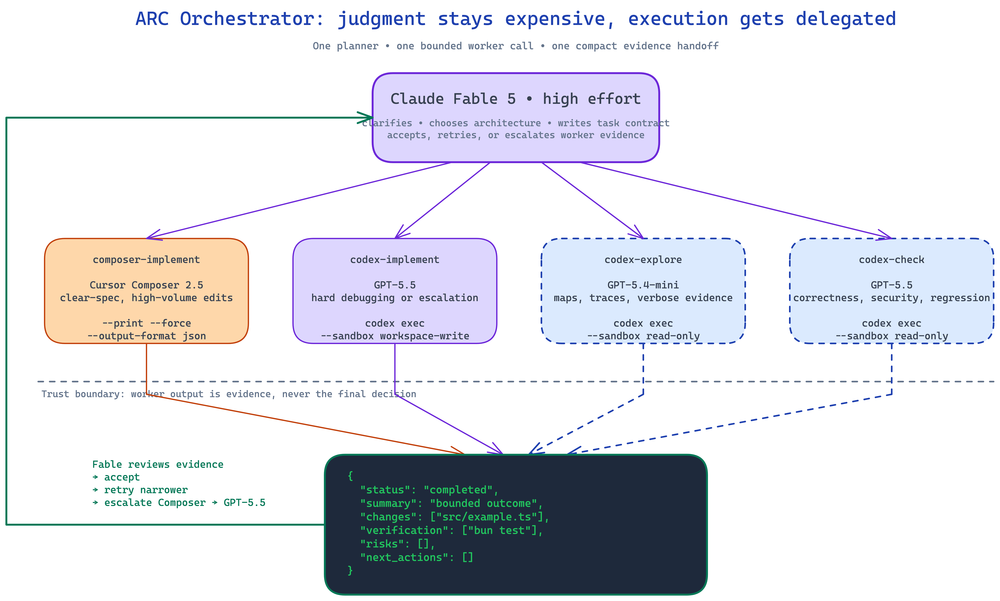
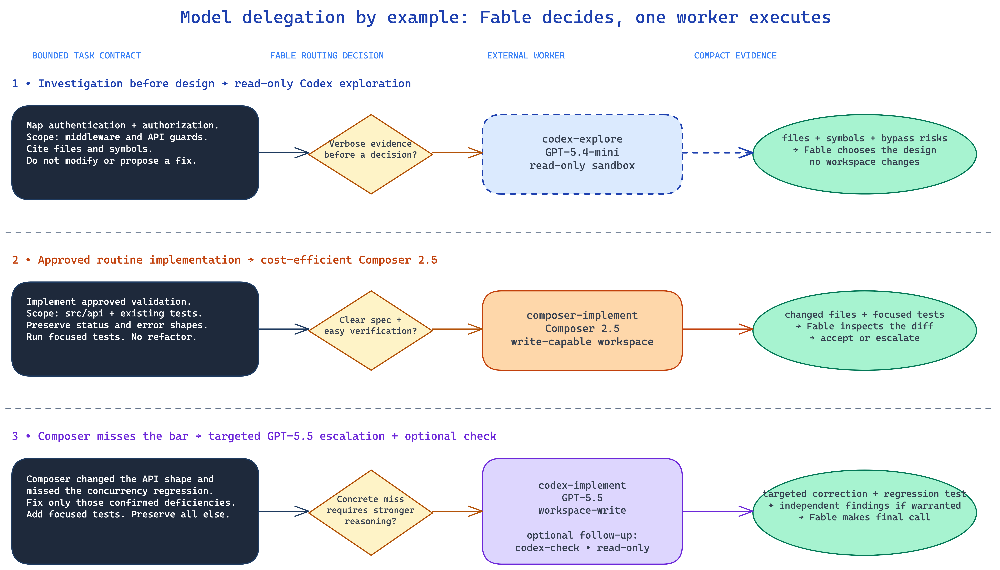

# ARC Orchestrator Diagrams

## System Architecture

The fan-out shows that Fable selects exactly one specialized worker. The convergence shows that every backend must return the same compact evidence contract before Fable makes a final decision.

[Open the editable Excalidraw source](arc-orchestrator-architecture.excalidraw)

## Delegation Examples

Three concrete examples show:

1. read-only exploration before architecture;
2. routine implementation through Composer 2.5;
3. targeted escalation to GPT-5.6 Terra (or Sol for taste-sensitive Codex work) with optional independent checking.

[Open the editable Excalidraw source](model-delegation-examples.excalidraw)

## Mermaid

See `mermaid.md` for:

- component architecture;
- the availability fallback chain (codex → claude → grok → minimax → kimi);
- routing decisions;
- the complete implementation and escalation sequence.
