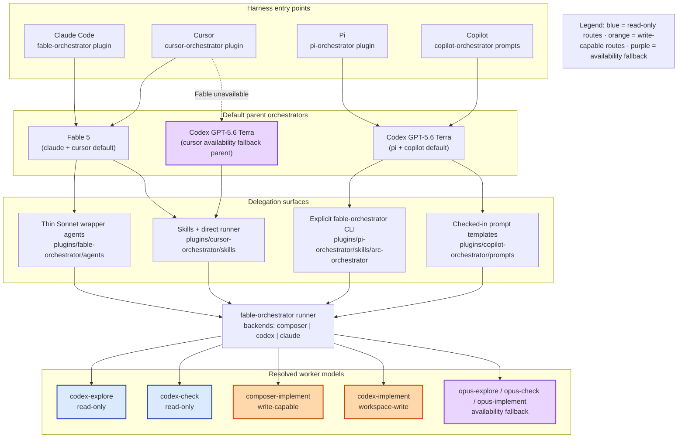
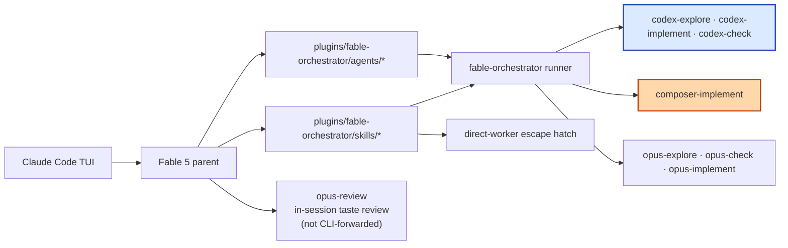
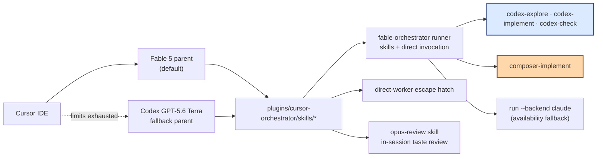
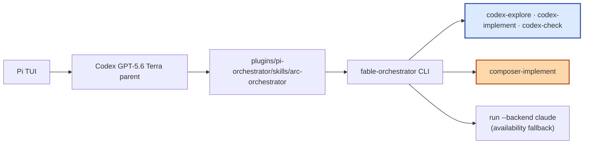
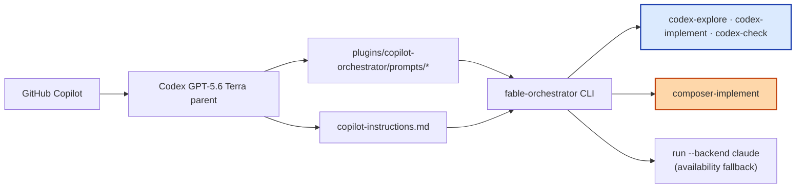
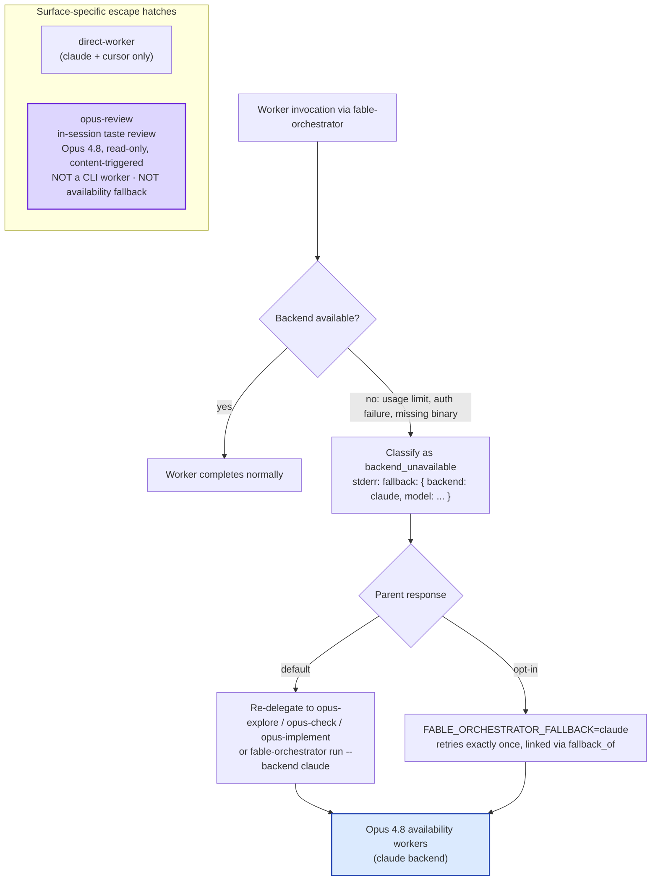

# Cross-Harness Orchestration Map

This is the **living canonical map** of how orchestration flows across Claude Code, Cursor, Pi, and Copilot. Sources of truth are `plugins/orchestrator-core/feature-matrix.ts`, `plugins/fable-orchestrator/skills/orchestrate/references/routing-policy.md`, and the per-surface orchestrate skills. `test/diagram-parity.test.ts` guards drift against the parity-anchor table below.

## Parity anchors

| Harness | Default parent | Fallback parent |
| --- | --- | --- |
| `claude` | `fable` | — |
| `cursor` | `fable` | `codex-5.6-terra` |
| `pi` | `codex-5.6-terra` | — |
| `copilot` | `codex-5.6-terra` | — |

## Cross-harness overview

## Fable (Claude Code)

Default parent: **`fable`**. Surface artifacts live under `plugins/fable-orchestrator/` — orchestrate, setup, observability, prompt-factory, and direct-worker skills; thin Sonnet wrapper agents for codex-*, composer-implement, and opus-* availability workers; `opus-review` agent for in-session taste review.

**Intentional differences:** Claude is the only surface with thin `opus-*` wrapper agents for availability fallback. Pi and Copilot reach the Claude backend via explicit `run --backend claude`. `direct-worker` and `opus-review` exist only on Claude and Cursor per the feature matrix.

## Cursor

Default parent: **`fable`**. Fallback parent when Fable is unavailable: **`codex-5.6-terra`**. Surface artifacts: `plugins/cursor-orchestrator/skills/*` (orchestrate, setup, observability, prompt-factory, direct-worker, opus-review) plus rules in `plugins/cursor-orchestrator/rules/orchestrator.mdc`. Workers are invoked through skills or direct runner calls — no thin opus-* Agent wrappers.

**Intentional differences:** Cursor has no thin `opus-*` wrapper agents; availability fallback uses direct runner `--backend claude` via the direct-worker skill. Cursor alone documents a Codex 5.6 Terra parent fallback when Fable is unavailable.

## Pi

Default parent: **`codex-5.6-terra`**. Surface artifact: `plugins/pi-orchestrator/skills/arc-orchestrator/SKILL.md` with explicit `fable-orchestrator` CLI commands. No dedicated prompt-factory, setup, observability, direct-worker, or opus-review surfaces.

**Intentional differences:** Pi is Codex-first with no Fable parent default, no direct-worker escape hatch, no opus-review surface (review routes through codex/review), and no thin opus-* agents — Claude backend is reached explicitly via `run --backend claude`.

## Copilot

Default parent: **`codex-5.6-terra`**. Surface artifacts: checked-in prompt templates under `plugins/copilot-orchestrator/prompts/` and guidance in `copilot-instructions.md`. Workers are invoked through explicit prompt templates, not auto-mode classification.

**Intentional differences:** Copilot has no prompt-factory, setup, observability, direct-worker, or opus-review surfaces. High-taste review routes through `codex/review` rather than Opus 4.8. Availability fallback uses explicit `run --backend claude` commands documented in copilot-instructions.md.

## Worker routes and backends

| Worker | Backend | Default model | Alternate models | Sandbox |
| --- | --- | --- | --- | --- |
| codex-explore | codex | gpt-5.6-luna | — | read-only |
| codex-implement | codex | gpt-5.6-terra | gpt-5.6-sol (taste-sensitive) | workspace-write |
| codex-check | codex | gpt-5.6-terra | gpt-5.6-sol (taste-sensitive) | read-only |
| composer-implement | composer | composer-2.5 (bulk clear-spec) | gpt-5.6-sol via `FABLE_ORCHESTRATOR_COMPOSER_MODEL` (explicit override) | write-capable |
| opus-explore / opus-check / opus-implement | claude | opus-4.8 | — (availability fallback only) | read-only (explore/check) · write (implement) |

## Fallbacks and escape hatches

When Codex is unavailable, the runner classifies the outage as `backend_unavailable` and emits a machine-readable fallback hint on stderr (`fallback: { backend: "claude", model: <resolved> }`). Ordinary task failures do not carry this hint.

**Parent-driven re-delegation (default):** Explicitly re-delegate to the matching availability-fallback worker (`opus-explore`, `opus-check`, or `opus-implement`) or invoke `fable-orchestrator run --backend claude --mode <analyze|review|implement>`. Record the switch with `annotate --escalated-to`. Claude Code has thin opus-* wrapper agents; Cursor, Pi, and Copilot reach the Claude backend through direct runner invocation.

**Opt-in automatic retry:** Set `FABLE_ORCHESTRATOR_FALLBACK=claude` (or `--fallback claude`) for unattended runs. The runner retries an availability-classified failure exactly once on the `claude` backend and links both trace records through `fallback_of`.

**Direct-worker escape hatch:** Available on Claude and Cursor surfaces only. Bypasses auto-mode classification blocks by invoking workers directly through the direct-worker skill.

**opus-review (distinct path):** In-session, content-triggered, read-only taste review using Opus 4.8 for UI/UX, API design, copy, and prompt/skill wording critique. This is **not** a CLI-forwarded worker and **not** the availability fallback — it is a separate high-taste review route triggered when design quality matters more than raw correctness.
