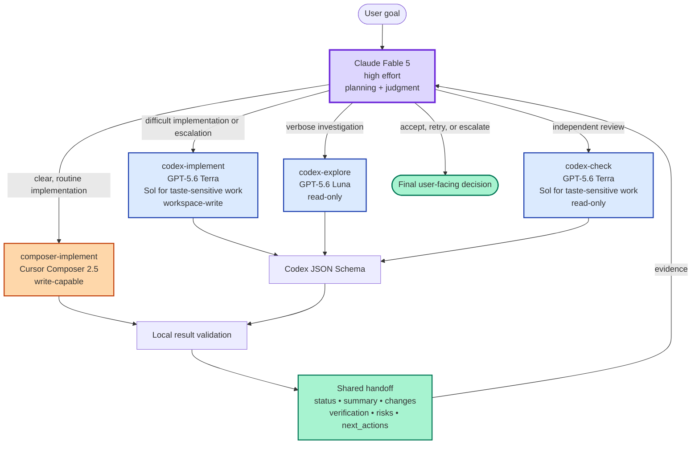
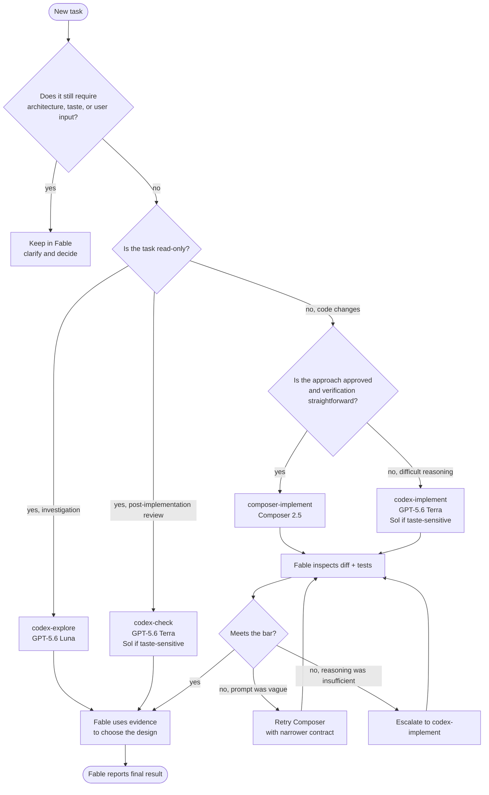
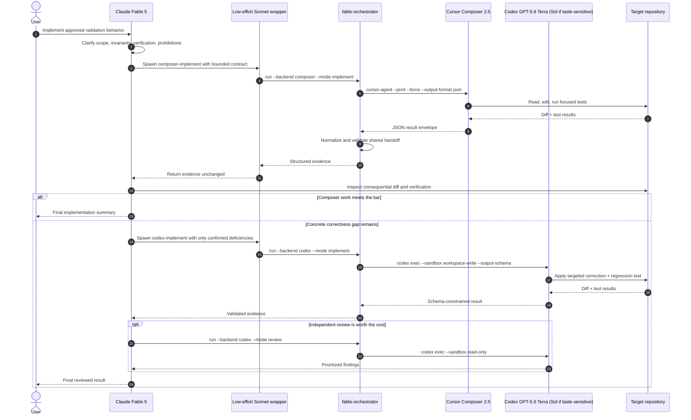

# Mermaid Diagrams

## Component Architecture

```mermaid
flowchart TB
    User([User goal]) --> Fable["Claude Fable 5<br/>high effort<br/>planning + judgment"]

    Fable -->|clear, routine implementation| Composer["composer-implement<br/>Cursor Composer 2.5<br/>write-capable"]
    Fable -->|difficult implementation or escalation| CodexImpl["codex-implement<br/>GPT-5.6 Terra<br/>Sol for taste-sensitive work<br/>workspace-write"]
    Fable -->|verbose investigation| Explore["codex-explore<br/>GPT-5.6 Luna<br/>read-only"]
    Fable -->|independent review| Check["codex-check<br/>GPT-5.6 Terra<br/>Sol for taste-sensitive work<br/>read-only"]

    Composer --> Normalize["Local result validation"]
    CodexImpl --> Schema["Codex JSON Schema"]
    Explore --> Schema
    Check --> Schema
    Schema --> Normalize

    Normalize --> Handoff["Shared handoff<br/>status • summary • changes<br/>verification • risks • next_actions"]
    Handoff -->|evidence| Fable
    Fable -->|accept, retry, or escalate| Result([Final user-facing decision])

    classDef planner fill:#ddd6fe,stroke:#6d28d9,stroke-width:3px;
    classDef composer fill:#fed7aa,stroke:#c2410c,stroke-width:2px;
    classDef codex fill:#dbeafe,stroke:#1e40af,stroke-width:2px;
    classDef evidence fill:#a7f3d0,stroke:#047857,stroke-width:2px;
    class Fable planner;
    class Composer composer;
    class CodexImpl,Explore,Check codex;
    class Handoff,Result evidence;
```

## Routing Decision

```mermaid
flowchart TD
    Start([New task]) --> Ambiguous{Does it still require<br/>architecture, taste, or user input?}
    Ambiguous -->|yes| Keep["Keep in Fable<br/>clarify and decide"]
    Ambiguous -->|no| ReadOnly{Is the task read-only?}

    ReadOnly -->|yes, investigation| Explore["codex-explore<br/>GPT-5.6 Luna"]
    ReadOnly -->|yes, post-implementation review| Check["codex-check<br/>GPT-5.6 Terra<br/>Sol if taste-sensitive"]
    ReadOnly -->|no, code changes| Clear{Is the approach approved<br/>and verification straightforward?}

    Clear -->|yes| Composer["composer-implement<br/>Composer 2.5"]
    Clear -->|no, difficult reasoning| CodexImpl["codex-implement<br/>GPT-5.6 Terra<br/>Sol if taste-sensitive"]

    Composer --> Inspect["Fable inspects diff + tests"]
    CodexImpl --> Inspect
    Explore --> Decide["Fable uses evidence<br/>to choose the design"]
    Check --> Decide

    Inspect --> Meets{Meets the bar?}
    Meets -->|yes| Decide
    Meets -->|no, prompt was vague| Retry["Retry Composer<br/>with narrower contract"]
    Meets -->|no, reasoning was insufficient| Escalate["Escalate to codex-implement"]
    Retry --> Inspect
    Escalate --> Inspect
    Decide --> Final([Fable reports final result])
```

## End-to-End Delegation Sequence

```mermaid
sequenceDiagram
    autonumber
    actor User
    participant Fable as Claude Fable 5
    participant Wrapper as Low-effort Sonnet wrapper
    participant Runner as fable-orchestrator
    participant Composer as Cursor Composer 2.5
    participant Codex as Codex GPT-5.6 Terra (Sol if taste-sensitive)
    participant Repo as Target repository

    User->>Fable: Implement approved validation behavior
    Fable->>Fable: Clarify scope, invariants, verification, prohibitions
    Fable->>Wrapper: Spawn composer-implement with bounded contract
    Wrapper->>Runner: run --backend composer --mode implement
    Runner->>Composer: cursor-agent --print --force --output-format json
    Composer->>Repo: Read, edit, run focused tests
    Repo-->>Composer: Diff + test results
    Composer-->>Runner: JSON result envelope
    Runner->>Runner: Normalize and validate shared handoff
    Runner-->>Wrapper: Structured evidence
    Wrapper-->>Fable: Return evidence unchanged
    Fable->>Repo: Inspect consequential diff and verification

    alt Composer work meets the bar
        Fable-->>User: Final implementation summary
    else Concrete correctness gap remains
        Fable->>Wrapper: Spawn codex-implement with only confirmed deficiencies
        Wrapper->>Runner: run --backend codex --mode implement
        Runner->>Codex: codex exec --sandbox workspace-write --output-schema
        Codex->>Repo: Apply targeted correction + regression test
        Repo-->>Codex: Diff + test results
        Codex-->>Runner: Schema-constrained result
        Runner-->>Fable: Validated evidence
        opt Independent review is worth the cost
            Fable->>Runner: run --backend codex --mode review
            Runner->>Codex: codex exec --sandbox read-only
            Codex-->>Fable: Prioritized findings
        end
        Fable-->>User: Final reviewed result
    end
```
