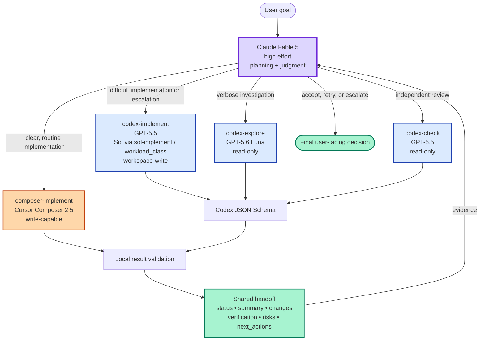
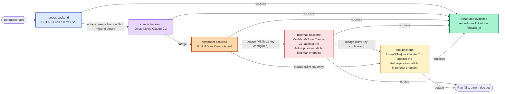
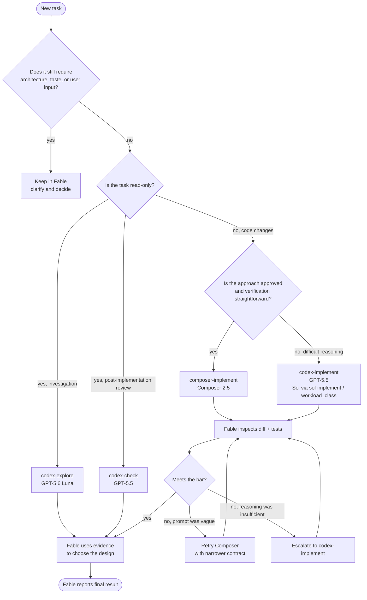
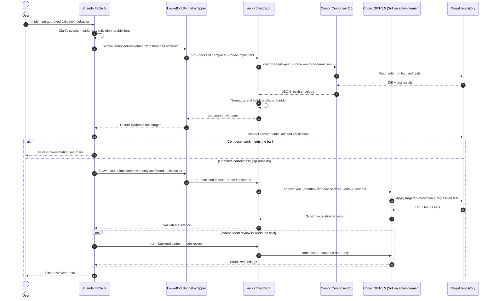

# Mermaid Diagrams

## Component Architecture

## Availability Fallback Chain

The chain is opt-in for unattended runs via `--fallback claude` (or `ARC_ORCHESTRATOR_FALLBACK=claude`): each availability-classified failure retries exactly once on the next tier. The MiniMax tier joins the chain when a pay-as-you-go key is configured (`ARC_ORCHESTRATOR_MINIMAX_API_KEY` or `MINIMAX_API_KEY`); the Kimi tier follows when a Moonshot key is configured (`ARC_ORCHESTRATOR_KIMI_API_KEY`, `MOONSHOT_API_KEY`, or `KIMI_API_KEY`). API-key tiers survive subscription exhaustion of Codex, Claude, and Cursor. `--worker-model <model>` pins the requested backend's model over env and policy; fallback tiers keep their own defaults.

## Routing Decision

## End-to-End Delegation Sequence

